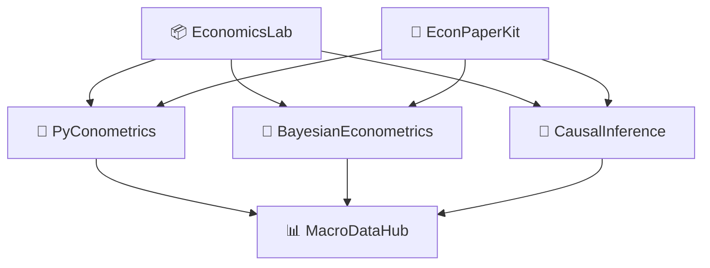

# 👋 Hi, I'm wzx11223344

### Economics × Machine Learning × Open Source

[](https://python.org)  
[](https://numpy.org)  
[](https://scipy.org)  
[](https://scikit-learn.org)

---

## Quick Links / 重点项目

> Repositories, demos and notebooks. Click a project to open the repo page and run its examples.

<table>
<tr>
<td width="50%" valign="top">
<h3>🌟 <a href="https://github.com/wzx11223344/econlab">EconomicsLab</a></h3>
<p>Interactive economics computing lab — built-in datasets, Jupyter tutorials, web dashboards</p>
<p>


</p>
<p>
<a href="https://mybinder.org/v2/gh/wzx11223344/econlab/HEAD?urlpath=lab">▶ Launch in Binder</a>
</p>
</td>
<td width="50%" valign="top">
<h3>🧠 <a href="https://github.com/wzx11223344/bayesmetrics">BayesianEconometrics</a></h3>
<p>From‑scratch Bayesian econometrics engine — NUTS/HMC/Gibbs/MH + BLR/Logit/VAR + diagnostics</p>
<p>


</p>
</td>
</tr>
<tr>
<td width="50%" valign="top">
<h3>🧬 <a href="https://github.com/wzx11223344/causal-inference-ml">CausalInference</a></h3>
<p>Bridging causal inference and ML — Double ML, Causal Forests, Meta-learners</p>
<p>


</p>
</td>
<td width="50%" valign="top">
<h3>🔬 <a href="https://github.com/wzx11223344/pyconometrics">PyConometrics</a></h3>
<p>Hand‑rolled econometrics library — OLS/IV/DID/RDD/Panel/Logit/Probit</p>
<p>


</p>
</td>
</tr>
<tr>
<td width="50%" valign="top">
<h3>📊 <a href="https://github.com/wzx11223344/macrodatahub">MacroDataHub</a></h3>
<p>Automated macro data aggregator — World Bank, FRED, China Stats</p>
<p>


</p>
</td>
<td width="50%" valign="top">
<h3>📝 <a href="https://github.com/wzx11223344/econpaperkit">EconPaperKit</a></h3>
<p>LaTeX toolkit for economics papers — three-line tables, macros, auto-compile</p>
<p>


</p>
</td>
</tr>
<tr>
<td width="50%" valign="top">
<h3>🔮 <a href="https://github.com/wzx11223344/econnet">EconNet</a></h3>
<p>Deep learning for economic time series — LSTM/TCN/Transformer/N-BEATS implemented in NumPy</p>
</td>
<td width="50%" valign="top">
<h3>🏛️ <a href="https://github.com/wzx11223344/policysim">PolicySim</a></h3>
<p>Policy simulation & counterfactual analysis — ABM + DID + Synthetic Control</p>
</td>
</tr>
<tr>
<td width="50%" valign="top">
<h3>📖 <a href="https://github.com/wzx11223344/textecon">TextEcon</a></h3>
<p>Economic text NLP — FOMC sentiment, LDA, word embeddings</p>
</td>
<td width="50%" valign="top">
<h3>🗺️ <a href="https://github.com/wzx11223344/spatialecon">SpatialEcon</a></h3>
<p>Spatial econometrics toolkit — Moran's I / SAR / SEM / SDM / SAC with concentrated MLE</p>
<p>
<a href="https://mybinder.org/v2/gh/wzx11223344/spatialecon/HEAD?urlpath=lab">▶ Launch SpatialEcon in Binder</a>
</p>
</td>
</tr>
</table>

---

## 技术能力 / Skills

| Area | Stack | Proficiency |
|------|-------|:-----------:|
| Econometrics | OLS, IV/2SLS, DID, RDD, Panel FE/RE, Logit/Probit, VAR | ██████████ |
| Bayesian Methods | MCMC (NUTS/HMC/Gibbs/MH), conjugate priors, diagnostics | █████████░ |
| Causal Inference | Double ML, Causal Forests, Meta‑learners | █████████░ |
| Machine Learning | Random Forest, GBM, LASSO, CV, Bootstrap | ████████░░ |
| Python | NumPy, SciPy, pandas, scikit-learn, Jupyter | ██████████ |
| Scientific Writing | LaTeX, BibLaTeX, TikZ, Beamer | ████████░░ |

---

## Project Map / 项目架构



---

## Try demos / 快速使用

Clone and run an example (SpatialEcon):

```bash
git clone https://github.com/wzx11223344/spatialecon.git
cd spatialecon
pip install -e .
python examples/demo.py
```

I can add Binder/Colab one‑click links for other projects; I already added Binder launcher links for EconomicsLab and SpatialEcon.

---

## Contributing / 贡献

Welcome issues and PRs. Typical contribution flow:

1. Fork → create branch (feature/...)  
2. Implement & add tests  
3. Open PR with description and test instructions

If you are new, look for issues labeled `good first issue`.

---

## Selected references

1. Chernozhukov et al. (2018) — Double/debiased ML
2. Athey et al. (2019) — Generalized Random Forests
3. Hoffman & Gelman (2014) — NUTS (No‑U‑Turn Sampler)
4. Angrist & Pischke (2009) — Mostly Harmless Econometrics
5. Künzel et al. (2019) — Metalearners

---

<div align="center">

📫 3521257027@QQ.com · [GitHub](https://github.com/wzx11223344)  

"经济学 + 编程 + 开源 = 无限可能" / "Economics + Code + Open Source = Endless Possibilities"

</div>
