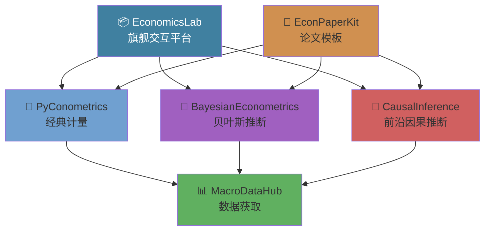

<div align="center">

# 👋 Hi, I'm wzx11223344

### 经济学 × 机器学习 × 开源

[](https://python.org)
[](https://numpy.org)
[](https://scipy.org)
[](https://scikit-learn.org)
[](https://www.latex-project.org)

[](https://github.com/wzx11223344)

</div>

---

## 🧬 项目矩阵

### 🔬 计量经济学

| 项目 | 描述 | 核心技术 |
|------|------|---------|
| [PyConometrics](https://github.com/wzx11223344/pyconometrics) | 从零实现计量经济学库 | OLS · IV/2SLS · DID/RDD · Panel · Logit |
| [MacroDataHub](https://github.com/wzx11223344/macrodatahub) | 全球宏观经济数据 | WB · FRED · China Stats |
| [EconPaperKit](https://github.com/wzx11223344/econpaperkit) | 经济论文LaTeX模板 | 三线表 · 自动编译 · BibLaTeX |
| [ExpressConsumption](https://github.com/wzx11223344/express-consumption) | 快递网点消费经济效应 | 1352份问卷 · Logistic回归 · 条件Logit |
| [EconDashboard](https://github.com/wzx11223344/econ-dashboard) | 经济数据看板 | Streamlit · Plotly · 20+实时宏观指标 |
| [FundAnalyzer](https://github.com/wzx11223344/fund-analysis) | 公募基金分析工具 | akshare · Sharpe/MaxDD · Markowitz组合优化 |

### 🧠 贝叶斯推断 & 因果推断

| 项目 | 描述 | 核心技术 |
|------|------|---------|
| [BayesianEconometrics](https://github.com/wzx11223344/bayesmetrics) | 贝叶斯计量引擎 | NUTS/HMC/Gibbs/MH · BVAR · R-hat |
| [CausalInference](https://github.com/wzx11223344/causal-inference-ml) | 因果推断×ML | Double ML · Causal Forest · Meta-Learners |

### 🤖 深度学习 & 前沿方法

| 项目 | 描述 | 核心技术 |
|------|------|---------|
| [EconNet](https://github.com/wzx11223344/econnet) | 经济时序深度学习 | LSTM · TCN · Transformer · N-BEATS |
| [DSGEpy](https://github.com/wzx11223344/dsgepy) | 动态随机一般均衡 | RBC · NK · Blanchard-Kahn · IRF |
| [TextEcon](https://github.com/wzx11223344/textecon) | 经济文本NLP | FOMC情绪 · LDA · 词嵌入 |
| [NetworkEcon](https://github.com/wzx11223344/networkecon) | 网络经济学 | 中心度 · SIR · 同伴效应 · Louvain |

### 💰 金融工程 & 博弈论

| 项目 | 描述 | 核心技术 |
|------|------|---------|
| [QuantLab](https://github.com/wzx11223344/quantlab) | 量化金融实验室 | Black-Scholes · Greeks · VaR · GARCH · NS曲线 |
| [GameTheory](https://github.com/wzx11223344/gametheory) | 博弈论与机制设计 | Lemke-Howson · 拍卖 · Gale-Shapley · ESS |

### 👨‍💼 劳动经济学 & 政策

| 项目 | 描述 | 核心技术 |
|------|------|---------|
| [LaborEcon](https://github.com/wzx11223344/laborecon) | 劳动经济学工具包 | Mincer · Heckman · Oaxaca · DMP |
| [PolicySim](https://github.com/wzx11223344/policysim) | 政策模拟引擎 | ABM · DID · Synthetic Control |

### 🌟 综合平台

| 项目 | 描述 | 核心技术 |
|------|------|---------|
| [EconomicsLab](https://github.com/wzx11223344/econlab) | 交互式计算实验室 | Jupyter · Web UI · 数据集 · 完整文档 |

---

## 📈 技术能力矩阵

| 领域 | 技术栈 | 熟练度 |
|------|--------|:------:|
| **计量经济学** | OLS, IV/2SLS, DID, RDD, Panel FE/RE, Logit/Probit, VAR | ██████████ |
| **贝叶斯推断** | MCMC (NUTS/HMC/Gibbs/MH), 共轭先验, 收敛诊断 | █████████░ |
| **因果推断** | Double ML, Causal Forest, Meta-Learners, 双重稳健 | █████████░ |
| **机器学习** | Random Forest, GBM, LASSO, Cross-Validation, Bootstrap | ████████░░ |
| **Python** | NumPy, SciPy, pandas, scikit-learn, Jupyter | ██████████ |
| **科学写作** | LaTeX, BibLaTeX, TikZ, Beamer, 学术论文模板 | ████████░░ |

---

## 🏗️ 项目架构 / Project Map



---

## 🔎 快速使用 / Try the demos

想快速运行某个项目的 demo/notebook：

```bash
# 克隆项目（以 SpatialEcon 为例）
git clone https://github.com/wzx11223344/spatialecon.git
cd spatialecon
pip install -e .
python examples/demo.py
```

大多数项目都包含 `examples/` 或 `notebooks/` 目录；查看每个仓库的 README 以获取具体说明。

> 想把 demo 放到 Binder/Colab 上？我可以为指定项目添加 Binder 配置并在 README 中放入“一键运行”按钮。

---

## 🤝 贡献 / Contributing

欢迎 Issue 和 PR。常见贡献流程：

1. Fork 仓库 → 新建分支（feature/xxx）
2. 新增/更新代码，并添加测试（若适用）
3. 提交 PR 并描述改动与测试步骤

对想贡献的新人：如果不确定从哪里开始，可查看仓库 Issues 中的 `good first issue` 标签（我可以为你标注适合入门的任务）。

---

## 📚 参考文献 / Selected References

1. Chernozhukov et al. (2018) — Double/debiased ML, _Econometrics Journal_
2. Athey et al. (2019) — Generalized Random Forests, _Annals of Statistics_
3. Hoffman & Gelman (2014) — No-U-Turn Sampler, _JMLR_
4. Angrist & Pischke (2009) — Mostly Harmless Econometrics, _Princeton_
5. Künzel et al. (2019) — Metalearners, _PNAS_

---

<div align="center">

### 📫 3521257027@QQ.com · [GitHub](https://github.com/wzx11223344)

*"经济学 + 编程 + 开源 = 无限可能" / "Economics + Code + Open Source = Endless Possibilities"*

</div>
