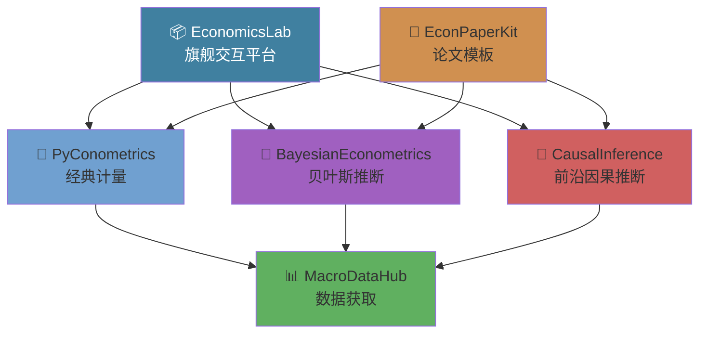

<div align="center">

# 👋 Hi, I'm wzx11223344

### 经济学 × 机器学习 × 开源

[](https://python.org)
[](https://numpy.org)
[](https://scipy.org)
[](https://scikit-learn.org)
[](https://www.latex-project.org)

[](https://github.com/wzx11223344)

</div>

---

## 🧬 重点项目（Quick Links）

> 每个项目都链接到对应仓库主页；如果仓库包含 demo、notebooks 或 examples，会在项目页中标注。

<table>
<tr>
<td width="50%" valign="top">
<h3>🌟 <a href="https://github.com/wzx11223344/econlab">EconomicsLab</a></h3>
<p>交互式经济学计算实验室 — 内置数据集 · Jupyter 教程 · Web 仪表盘</p>
<p>


</p>
<p>
<a href="https://github.com/wzx11223344/econlab/tree/main/examples">▶ Demo / Examples</a>
</p>
</td>
<td width="50%" valign="top">
<h3>🧠 <a href="https://github.com/wzx11223344/bayesmetrics">BayesianEconometrics</a></h3>
<p>从零实现的贝叶斯计量引擎 — NUTS/HMC/Gibbs/MH + BLR/Logit/VAR + 收敛诊断</p>
<p>


</p>
<p>
<a href="https://github.com/wzx11223344/bayesmetrics">▶ Repo</a>
</p>
</td>
</tr>
<tr>
<td width="50%" valign="top">
<h3>🧬 <a href="https://github.com/wzx11223344/causal-inference-ml">CausalInference</a></h3>
<p>因果推断 × 机器学习融合引擎 — Double ML + Causal Forest + Meta-Learners</p>
<p>


</p>
<p>
<a href="https://github.com/wzx11223344/causal-inference-ml">▶ Repo</a>
</p>
</td>
<td width="50%" valign="top">
<h3>🔬 <a href="https://github.com/wzx11223344/pyconometrics">PyConometrics</a></h3>
<p>从零实现的计量经济学 Python 库 — OLS/IV/DID/RDD/Panel/Logit/Probit</p>
<p>


</p>
<p>
<a href="https://github.com/wzx11223344/pyconometrics">▶ Repo</a>
</p>
</td>
</tr>
<tr>
<td width="50%" valign="top">
<h3>📊 <a href="https://github.com/wzx11223344/macrodatahub">MacroDataHub</a></h3>
<p>全球宏观经济数据自动化工具 — World Bank + FRED + China Stats</p>
<p>


</p>
<p>
<a href="https://github.com/wzx11223344/macrodatahub">▶ Repo</a>
</p>
</td>
<td width="50%" valign="top">
<h3>📝 <a href="https://github.com/wzx11223344/econpaperkit">EconPaperKit</a></h3>
<p>经济学论文 LaTeX 模板套件 — 三线表 + 计量公式宏包 + 自动编译</p>
<p>


</p>
<p>
<a href="https://github.com/wzx11223344/econpaperkit">▶ Repo</a>
</p>
</td>
</tr>
<tr>
<td width="50%" valign="top">
<h3>🔮 <a href="https://github.com/wzx11223344/econnet">EconNet</a></h3>
<p>深度学习经济时序预测 — LSTM/TCN/Transformer/N-BEATS 纯NumPy实现</p>
<p>
<a href="https://github.com/wzx11223344/econnet">▶ Repo</a>
</p>
</td>
<td width="50%" valign="top">
<h3>🏛️ <a href="https://github.com/wzx11223344/policysim">PolicySim</a></h3>
<p>政策模拟与反事实分析引擎 — ABM+DID+Synthetic Control 从底层构建</p>
<p>
<a href="https://github.com/wzx11223344/policysim">▶ Repo</a>
</p>
</td>
</tr>
<tr>
<td width="50%" valign="top">
<h3>📖 <a href="https://github.com/wzx11223344/textecon">TextEcon</a></h3>
<p>经济文本NLP分析 — 美联储FOMC情绪+LDA主题建模+词嵌入</p>
<p>
<a href="https://github.com/wzx11223344/textecon">▶ Repo</a>
</p>
</td>
<td width="50%" valign="top">
<h3>🗺️ <a href="https://github.com/wzx11223344/spatialecon">SpatialEcon</a></h3>
<p>空间计量经济学工具包 — Moran's I/SAR/SEM/SDM/SAC + 浓缩MLE</p>
<p>
<a href="https://github.com/wzx11223344/spatialecon">▶ Repo</a>
</p>
</td>
</tr>
</table>

---

## 📈 技术能力矩阵

| 领域 | 技术栈 | 熟练度 |
|------|--------|:------:|
| **计量经济学** | OLS, IV/2SLS, DID, RDD, Panel FE/RE, Logit/Probit, VAR | ██████████ |
| **贝叶斯推断** | MCMC (NUTS/HMC/Gibbs/MH), 共轭先验, 收敛诊断 | █████████░ |
| **因果推断** | Double ML, Causal Forest, Meta-Learners, 双重稳健 | █████████░ |
| **机器学习** | Random Forest, GBM, LASSO, Cross-Validation, Bootstrap | ████████░░ |
| **Python** | NumPy, SciPy, pandas, scikit-learn, Jupyter | ██████████ |
| **科学写作** | LaTeX, BibLaTeX, TikZ, Beamer, 学术论文模板 | ████████░░ |

---

## 🏗️ 项目架构 / Project Map



---

## 🔎 快速使用 / Try the demos

想快速运行某个项目的 demo/notebook：

```bash
# 克隆项目（以 SpatialEcon 为例）
git clone https://github.com/wzx11223344/spatialecon.git
cd spatialecon
pip install -e .
python examples/demo.py
```

大多数项目都包含 `examples/` 或 `notebooks/` 目录；查看每个仓库的 README 以获取具体说明。

> 想把 demo 放到 Binder/Colab 上？我可以为指定项目添加 Binder 配置并在 README 中放入“一键运行”按钮。

---

## 🤝 贡献 / Contributing

欢迎 Issue 和 PR。常见贡献流程：

1. Fork 仓库 → 新建分支（feature/xxx）
2. 新增/更新代码，并添加测试（若适用）
3. 提交 PR 并描述改动与测试步骤

对想贡献的新人：如果不确定从哪里开始，可查看仓库 Issues 中的 `good first issue` 标签（我可以为你标注适合入门的任务）。

---

## 📚 参考文献 / Selected References

1. Chernozhukov et al. (2018) — Double/debiased ML, _Econometrics Journal_
2. Athey et al. (2019) — Generalized Random Forests, _Annals of Statistics_
3. Hoffman & Gelman (2014) — No-U-Turn Sampler, _JMLR_
4. Angrist & Pischke (2009) — Mostly Harmless Econometrics, _Princeton_
5. Künzel et al. (2019) — Metalearners, _PNAS_

---

<div align="center">

### 📫 3521257027@QQ.com · [GitHub](https://github.com/wzx11223344)

*"经济学 + 编程 + 开源 = 无限可能" / "Economics + Code + Open Source = Endless Possibilities"*

</div>
